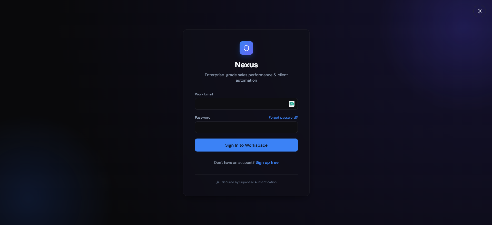
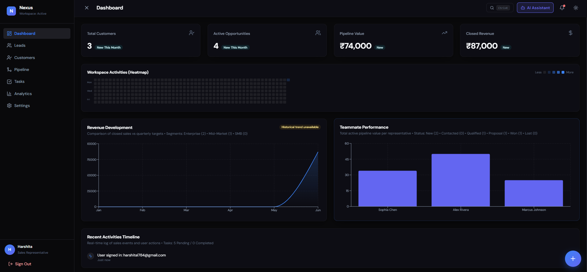
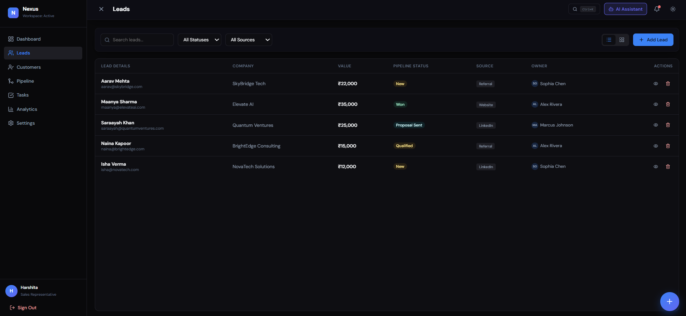
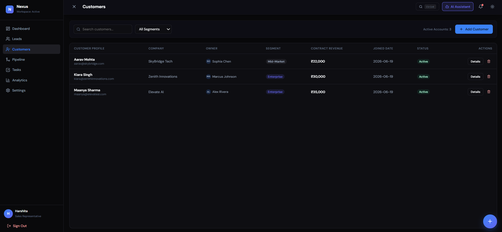
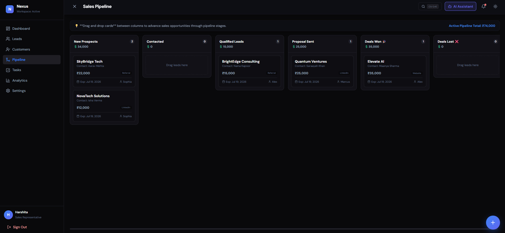
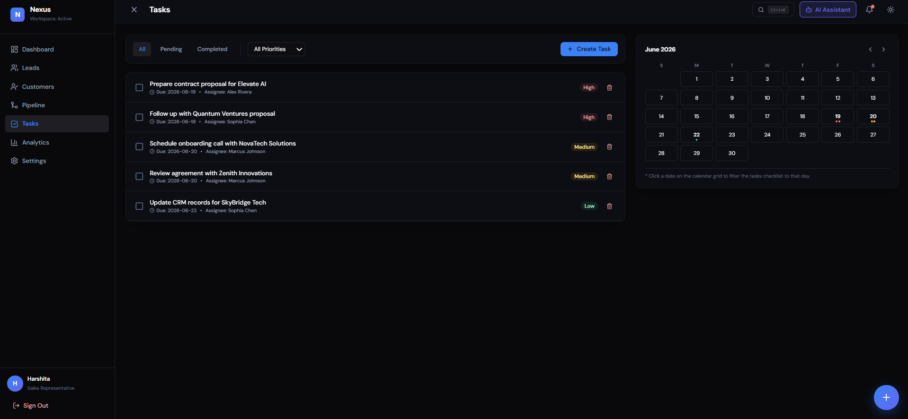
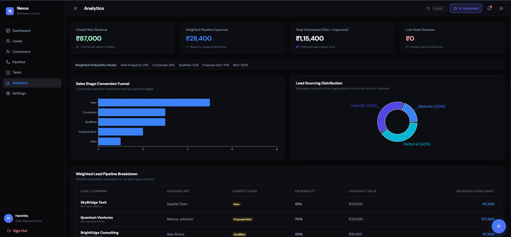

# 🪐 Nexus

[](https://future-fs-02-gamma-two.vercel.app)
[](https://github.com/harshita7126/FUTURE_FS_02)

> **Future Interns** • Full Stack Web Development Fellowship  
> **Track Assignment ID:** `FUTURE_FS_02`  
> **Corporate Intern ID (CIN ID):** `FIT/MAY26/FS16867`

Nexus is an enterprise-grade multi-tenant software workspace engineered for high-velocity customer pipelines, financial revenue forecasting, and transactional lifecycle tracking.

Built with a premium dark-mode glassmorphic interface inspired by platforms like Linear, Notion, and Attio, Nexus couples a responsive React single-page application engine with a production cloud infrastructure layer managed via Supabase.

---

## 🎯 Project Overview

Nexus is a full-stack Customer Relationship Management (CRM) platform designed to streamline lead acquisition, customer management, sales pipeline tracking, task coordination, and revenue forecasting within a unified workspace.

The application leverages React and Supabase to provide a secure multi-tenant architecture where each user operates within an isolated workspace protected by PostgreSQL Row Level Security (RLS). Through interactive dashboards, analytics, Kanban-based pipeline management, and real-time database synchronization, Nexus delivers a modern sales operations experience suitable for startups, agencies, and growing businesses.

---

## 🚀 Feature Highlights

- **Secure Authentication**: Built-in signup, login, and protected session routing.
- **Multi-User Workspaces**: Complete multi-tenant data isolation per user account.
- **Lead Management**: Complete tracking of acquisition sources, contact parameters, and ownership.
- **Customer Management**: Converted profile records monitoring lifecycle metrics and contract revenue.
- **Sales Pipeline**: Interactive Kanban pipeline displaying real-time financial tracking.
- **Drag-and-Drop Board**: Native HTML5 browser drag-and-drop mechanics for stage promotions.
- **Task Management**: Checklist board cross-sorted by strict priorities and calendar deadlines.
- **Revenue Analytics**: Dynamic sales stage conversion funnels and acquisition distributions.
- **Activity Heatmap**: Custom contribution grid tracking daily workspace actions visually.
- **Supabase Integration**: Live cloud infrastructure syncing database logic and user states.
- **PostgreSQL Database**: Relational multi-table schema layout housing workspace entities.
- **Row Level Security (RLS)**: Server-side data protection policies enforced directly on database clusters.

---

## 🔗 Live Operations Deployment

| Deployment Vector | Production Endpoint URL | System Operational Status |
| :--- | :--- | :--- |
| **Vercel Edge Network** | [Live Demo](https://future-fs-02-gamma-two.vercel.app) | 🟢 ONLINE / STABLE |

---

## 🔒 Security & Multi-Tenant Architecture

Nexus separates itself from basic CRUD projects by transitioning data management completely to a secure backend, ensuring user isolation via database-level security rules rather than client-side filtering.

- **Supabase Authentication**: Integrated user registration, secure session state token verification, and sign-out pipelines.
- **PostgreSQL Row Level Security (RLS)**: Fine-grained relational access control policies executing queries straight inside the cloud cluster based on individual user authentication tokens.
- **Isolating Tenant Workspaces**: Secure sandbox architecture preventing any user from reading, writing, updating, or deleting another user's workspace parameters.
- **On-Demand Demo Seeding**: Integrated client-side utility routines allowing users to instantly seed a clean database context with dummy records or safely reset database structures.

---

## 📸 Production Workspace Previews

### Authentication Portal



### Executive Command Center



### Leads Management Hub



### Customer Accounts Directory



### Kanban Pipeline Board



### Task Management



### Conversion Analytics Dashboard



---

## 🛠️ Technological Infrastructure Stack

### Frontend

- React.js
- Vite
- React Context API
- Recharts
- Lucide React

### Backend & Database

- Supabase Authentication
- PostgreSQL
- Row Level Security (RLS)

### Styling

- CSS3
- Glassmorphic UI Design
- Responsive Layouts

### Deployment

- Vercel

---

### Additional Libraries

- React Router DOM
- Supabase JS SDK

## ✅ Build Verification

The application has been successfully compiled and verified for production deployment.

```bash
npm run build
```

## ✅ Production Status

- Application successfully built for production
- Deployed on Vercel Edge Network
- Supabase backend connected
- PostgreSQL database operational
- Authentication verified
- Multi-tenant RLS policies active

## ⚙️ Local Development Setup

Clone the repository and spin up the development server locally:

```bash
git clone https://github.com/harshita7126/FUTURE_FS_02.git
cd FUTURE_FS_02
npm install
npm run dev
```

### 🔑 Environment Variables

Create a `.env` file in the project root directory and add the following keys:

```env
VITE_SUPABASE_URL=your_supabase_url
VITE_SUPABASE_ANON_KEY=your_supabase_anon_key
```

---

## 👩‍💻 Author

**Harshita Labba**  
*B.Tech Computer Science & Engineering*  
Future Interns – Full Stack Web Development Fellowship  

🔗 **GitHub**: [harshita7126](https://github.com/harshita7126)
